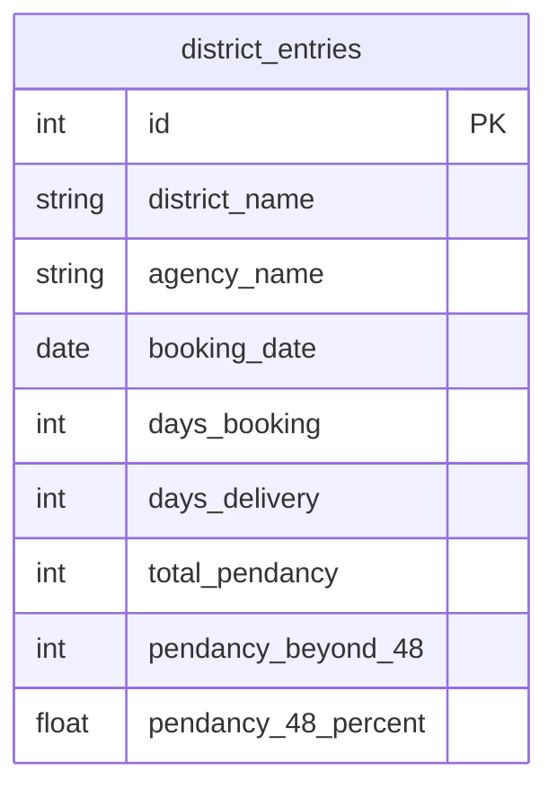

# LPG_PUNSUP – Punjab State Civil Supplies Corporation Limited (PUNSUP)

## 📌 Overview

**LPG_PUNSUP** is a backend and reporting solution for **Punjab State Civil Supplies Corporation Limited (PUNSUP)** to manage **LPG booking and delivery performance tracking**.
It is built on a **legacy PHP 5.6 & MySQL 5.7** stack, optimized for Apache-based WAMP/XAMPP environments, and supports **district-level monitoring of booking pendency** and **delivery performance**.

The system provides:

* Tracking of LPG bookings and deliveries for each district/agency.
* Monitoring pendency beyond 48 hours and percentage analysis.
* District-wise performance reports for operational review.

---

## 📂 Modules & Database Structure

### **Booking & Delivery Tracking**

* **district\_entries** – Contains LPG booking and delivery pendency data for each district.

---

## ⚙️ Technology Stack

* **Backend:** PHP 5.6 (Full PHP tags, procedural style)
* **Database:** MySQL 5.7 (No window functions, compatible queries)
* **Server:** Apache (WAMP/XAMPP)
* **Frontend:** HTML, Bootstrap, minimal JavaScript
* **Reports:** TCPDF/FPDF (PDF generation), CSV Export

---

## 📜 Features

* **District-wise LPG booking entry** and performance tracking.
* **Automatic pendency calculation** including % beyond 48 hours.
* **Role-based access** for district and head office users.
* **Reports:**

  * Daily/Monthly booking vs delivery
  * Pendency beyond 48 hours (absolute & %)
  * Comparative district performance reports

---

## 🔄 LPG Monitoring Workflow


---

## 🗄 Database Relationship Diagram



---

## 🚀 Installation

1. Clone the repository:

   ```bash
   git clone https://github.com/your-org/LPG_Support_Tool.git
   ```
2. Configure database connection in **`db_connect.php`**.
3. Import SQL schema from `sql/` folder into MySQL 5.7.
4. Place the project inside Apache’s `htdocs/` or `www/` directory.
5. Access via browser:

   ```
   http://localhost/LPG_Support_Tool/
   ```

---

## 🛠 Development Notes

* All SQL queries are optimized for MySQL 5.7 (no CTEs or window functions).
* Data entry and reporting are designed for **fast district-level monitoring**.
* Calculations for pendency beyond 48 hours are **automatic** based on booking/delivery data.

---

## 📄 License

This project is internal to **PUNSUP** and is not for public distribution.

